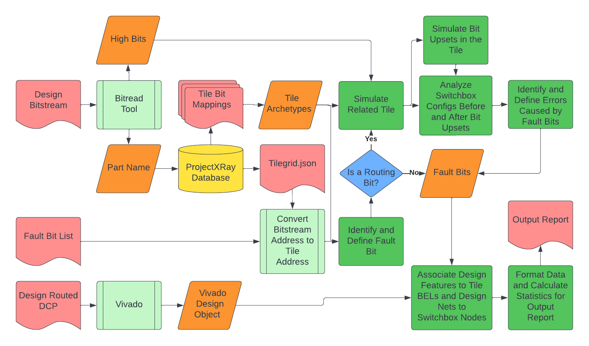

# BFAT (Bitstream Fault Analysis Tool)

---

## About:

BFAT is a tool used for analysis of a design's bitstream to evaluate and report any relevant information about given fault bits as well as any errors that they would cause in the design's implementation. BFAT is being used for research purposes and is currently under development. So far BFAT supports most Xilinx 7-Series FPGAs that are documented in the [Project X-Ray database](https://github.com/f4pga/prjxray-db). The full list of parts can be found below in the "Supported Parts" section. 

BFAT consists of the following scripts:

- `bfat.py`: The main script that is run on a design and creates a .txt file to report the information found.
- `bitread.py` : python tool used to convert bitstream to ascii representation of high bits in bitstream and identify the part used to implement the provided design. Can also be run by itself to convert a bitstream to a .bits file containing the ascii representation of the high bits in the bitstream.

Scripts included from the local library:

- `bit_definitions.py`: Uses created dataclasses and program arguments to define and evaluate each of the given fault bits.
- `design_query.py` : Deals with querying design information from its .dcp checkpoint file and includes the default implementation using Vivado.
- `file_processing.py`: Deals with all external file reading and parsing.
- `rpd_query.py`: Deals with querying the design information from its .dcp checkpoint file using the Rapidwright tool.
- `statistics.py`: Reads the report data for the design and adds a footer at the end of the report file to report some statistics of the design and faults found.
- `tile.py`: Creates the classes to store the information on the tiles and routing muxes for the given FPGA design.

Utility scripts to generate fault bit lists for user designs (see `docs/sample_bit_scripts.md` for more info):

- `find_fault_bits.py`: python tool that a user can use on their own design to generate a sample fault bit list
- `ll_sample_bits.py`: python tool that a user can run on a generated logic location (.ll) file to generate a sample fault bit list
- `essential_bits.py`: python tool that a user can run on a generated essential bits (.ebd) file to generate a sample fault bit list

BFAT requires the use of Vivado or Rapidwright to read dcp files in order to retrieve information about the design being analyzed. BFAT runs using a sourced version of Vivado by default, but can be run using Rapidwright with the `-rpd` flag.

BFAT utilizes the ProjectXray database in its design analysis and clones the database repo from Github during setup.

---

## BFAT Process Flowchart


---

## Quickstart Guide

1. Clone the BFAT repo from Github along with its submodule
    ```
    git clone --recurse-submodules https://github.com/byuccl/bfat.git
    cd bfat
    ```

2. Install Vivado HDL Tools
    > **Note:** We recommend Vivado version 2021.2 or later, as earlier versions are untested and we cannot guarantee that they will work

3. Install Python 3.8+, its corresponding Virtual Environement (venv) module, and a valid Java JDK
    ```
    sudo apt install python<dist> python<dist>-venv default-jdk
    ```

4. Create and activate a Python Virtual Environment
    ```
    python<dist> -m venv env/
    source env/bin/activate
    ```

5. Install required packages for Rapidwright (while venv is activated)
    ```
    pip install -r requirements.txt
    ```

---

## How to Use BFAT

1. Source Python Virtual Environment
    ```
    source env/bin/activate
    ```

2. Source Vivado tooling
    ```
    source /opt/Xilinx/Vivado/<vivado_version>/settings64.sh
    ```
    > **Note:** This is the default path for Vivado installation. Vivado may be installed in a different directory on your machine.


3. Run the bfat.py script providing it with:
    - The bitstream of the design to be analyzed
        > **Note:** If the bits_file flag (-bf) is used, a .bits file (as generated from bitread.py) will be read in instead of a bitstream
    - A dcp checkpoint file of the routed design to be analyzed
    - A list of fault bits to evaluate in a .json file (see `docs/fault_bit_lists.md` for details on formatting)
    - The `-rpd` flag if running with Rapidwright


4. *(Optional)* Using the `-of` flag you can specify the file the fault report will be output to. If not used, the report will be saved to a file with a generated name in the current directory.

**Template command to run BFAT:**
    ```
    python3 bfat.py <bitstream> <dcp> <fault_bits>
    ```

*To see more specifics on running BFAT, look at the help information provided by running `python3 bfat.py -h`

---

## Notes:

- When using the Rapidwright implementation of the design query, Rapidwright will attempt to read the checkpoint data from the following sources in order:
    1. The buried edf file inside the dcp checkpoint file if it is not encrypted.
    2. An edf file of the same file name in the same directory.
    3. Loading the dcp into Vivado and writing a usable edf file
        - If it reaches this point, the read will not be able to happen and an error will be thrown if some version of vivado has not already been sourced.
                
            ```
            source /opt/Xilinx/Vivado/<vivado_version>/settings64.sh
            ```
            > **Note:** that this is the default path. Vivado may be installed in a different directory on your machine.

---

## Supported Parts:

### Artix-7
- xc7a50t family
- xc7a100t family
- xc7a200t family

### Kintex-7
- xc7k70t family

### Spartan-7
- xc7s50 family

### Zynq-7000
- xc7z010 family
- xc7z020 family
