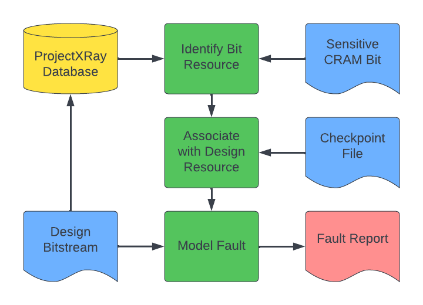

# BFAT (Bitstream Fault Analysis Tool)

---

## About:

BFAT is a tool used for analysis of a design's bitstream to evaluate and report any relevant information about given fault bits as well as any errors that they would cause in the design's implementation. BFAT is being used for research purposes and is currently under development. So far BFAT supports most Xilinx 7-Series FPGAs that are documented in the [Project X-Ray database](https://github.com/f4pga/prjxray-db). The full list of parts can be found below in the "Supported Parts" section. 

BFAT consists of the following scripts:

- `bfat.py`: The main script that is run on a design and creates a .txt file to report the information found.
- `bitread.py` : python tool used to convert bitstream to ascii representation of high bits in bitstream and identify the part used to implement the provided design. Can also be run by itself to convert a bitstream to a .bits file containing the ascii representation of the high bits in the bitstream.
- `find_fault_bits.py`: python tool that a user can use on their own design to generate a sample fault bit list which can then be run through BFAT (see `docs/fault_report.md` for information on how to run)

Scripts included from the local library:

- `bit_definitions.py`: Uses created dataclasses and program arguments to define and evaluate each of the given fault bits.
- `design_query.py` : Deals with querying design information from its dcp checkpoint file and includes the default implementation using Vivado.
- `file_processing.py`: Deals with all external file reading and parsing.
- `statistics.py`: Reads the report data for the design and adds a footer at the end of the report file to report some statistics of the design and faults found.
- `tile.py`: Creates the classes to store the information on the tiles and routing muxes for the given FPGA design.

BFAT requires the use of a version of Vivado to read dcp files in order to retrieve information about the design being analyzed.

BFAT utilizes the ProjectXray database in its design analysis and clones the database repo from Github during setup.

---

## BFAT Process Flowchart


---

## Installation and Setup

Clone the BFAT repo from Github along with its submodule

```
    git clone --recurse-submodules https://github.com/byuccl/bfat.git
    cd bfat
```

To get the data from the provided checkpoint file, BFAT will open a pipe to Vivado and retrieve information through tcl commands. Make sure that you have Vivado installed on your system
* We recommend version 2021.2 or later, as earlier versions are untested and we cannot guarantee that they will work

BFAT requires python 3.8 or later. Install a supported version if you do not already have one in your system.

---

## How to Use BFAT

1. If you have not sourced a version of Vivado, do so:
```
    source /opt/Xilinx/Vivado/<vivado_version>/settings64.sh
```
* Note that this is the default path. Vivado may be installed in a different directory on your machine.

2. Run the bfat.py script providing it with:
    - The bitstream of the design to be analyzed
        - If the bits_file flag (-bf) is used, a .bits file (as generated from bitread.py) will be read in instead of a bitstream
    - A dcp checkpoint file of the routed design to be analyzed
    - A list of fault bits to evaluate in a .json file (see `docs/fault_bit_lists.md` for details on formatting)

3. (Optional) Using the `-of` flag you can specify the file the fault report will be output to. If not used, the report will be saved to a file with a generated name in the current directory.

Template command to run BFAT:
```
    python3 bfat.py <bitstream> <dcp> <fault_bits>
```

To see more specifics on running BFAT, look at the help information provided by running `python3 bfat.py -h`

---

## Supported Parts:

### Artix-7
- xc7a50t family
- xc7a100t family
- xc7a200t family

### Kintex-7
- xc7k70t family

### Spartan-7
- xc7s50 family

### Zynq-7000
- xc7z010 family
- xc7z020 family
